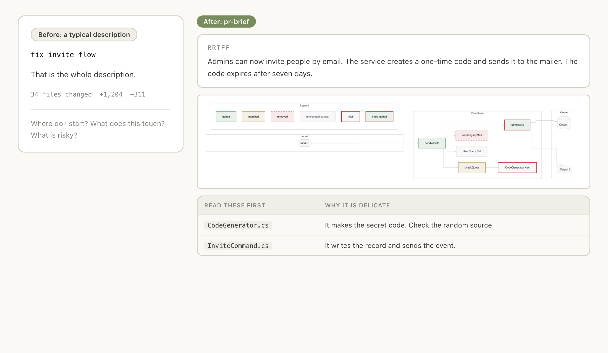
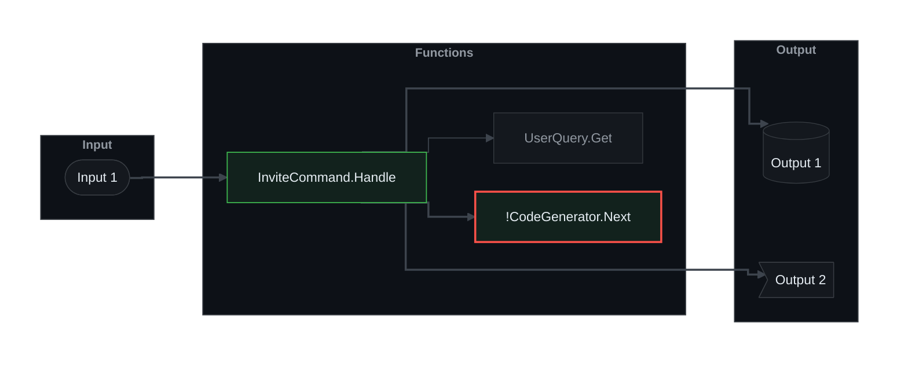
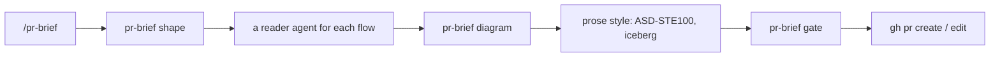
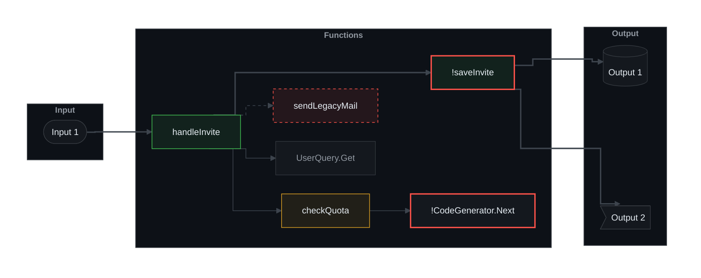
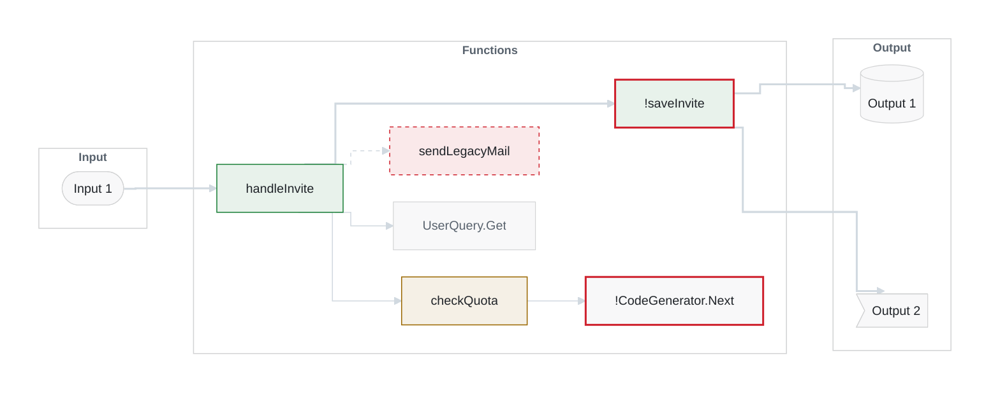
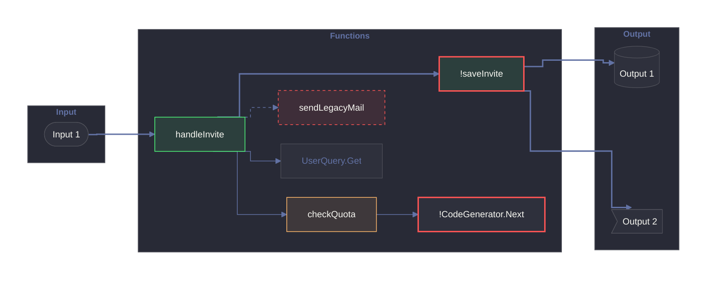
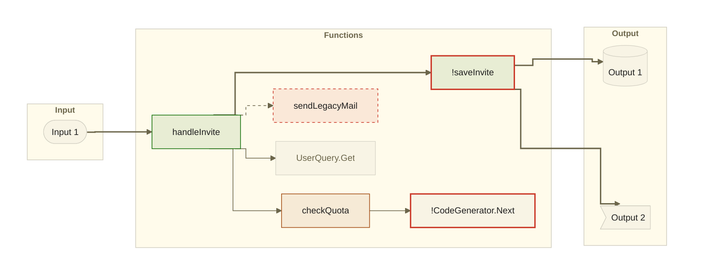

<p align="center"></p>

<h1 align="center">pr-brief</h1>

<p align="center"><b>PR descriptions a reviewer can read: a brief, a flow diagram, a reading order.</b></p>

<p align="center">
  <a href="https://github.com/gagoar/pr-brief/actions/workflows/ci.yml"></a>
  <a href="https://github.com/gagoar/pr-brief/releases"></a>
  
</p>

<p align="center">
  <a href="https://gagoar.github.io/pr-brief/"><b>Website</b></a> ·
  <a href="#install">Install</a> ·
  <a href="https://gagoar.github.io/pr-brief/convention.html">Convention over configuration</a> ·
  <a href="https://gagoar.github.io/pr-brief/themes.html">Themes</a> ·
  <a href="https://gagoar.github.io/pr-brief/gate.html">The gate</a>
</p>

<picture>
  <source media="(prefers-color-scheme: dark)" srcset="docs/assets/hero-dark.png">
  <source media="(prefers-color-scheme: light)" srcset="docs/assets/hero-light.png">
  
</picture>

Large pull requests are hard to review because nobody knows where to start. pr-brief writes the description for you, and a gate keeps every PR that way. It is a Claude Code plugin, a GitHub Action and a Go CLI. The PR title is never touched. Only the description changes.

## Install

### Requirements

pr-brief calls two other pieces of software. **Claude Code does not install them for you.** Install them first, or the skill stops and tells you what is missing. It never switches style on its own.

| Needs | What it is | Install | Required by style |
|---|---|---|---|
| [asd-ste100](https://github.com/danyuchn/asd-ste100-skill) | A skill: the ASD-STE100 writing rules | `git clone https://github.com/danyuchn/asd-ste100-skill ~/.claude/skills/asd-ste100` | `ste`, `ste+iceberg` (the default) |
| iceberg | A plugin: the Hemingway-style editor (`iceberg:edit`) | `/plugin marketplace add gagoar/gago-plugins`, then `/plugin install iceberg@gago-plugins` | `iceberg`, `ste+iceberg` (the default) |

To need only one of them, change the style: `/pr-brief config style iceberg` needs only iceberg, and `ste` needs only asd-ste100. The CI check and the CLI need neither.

### The plugin

```
/plugin marketplace add gagoar/gago-plugins
/plugin install pr-brief@gago-plugins
```

Or straight from this repo: `/plugin marketplace add gagoar/pr-brief`, then `/plugin install pr-brief@pr-brief`.

Then, on any branch, run `/pr-brief`. To rewrite a PR that exists, run `/pr-brief improve 123`. It saves the old description first and asks before it writes.

## What you get

1. **Brief.** One paragraph. What the system does differently now, and the effect. No file names.
2. **Change map.** One Input → Functions → Output diagram for each flow, drawn by the tool in a theme. The Input and Output boxes show the word and a number (`Input 1`, `Output 1`); a References table explains them, so the diagram stays small. Function boxes show names only, with no parentheses. A Legend line directly under the diagram names every colour it uses, in one row.
3. **Review guide.** What changed, a ranked table of the files that carry logic and risk, and where to start reading. Each file in that table is a link to its diff in the PR.

A rewrite never loses a **Jira or Linear ticket**. `/pr-brief improve` reads every ticket in the old description (links, bare keys such as `ABC-123`, and words such as `Closes ENG-45`) and in the branch name, and keeps them in a `**Tickets:**` line above the markers. It refuses to write if one would be lost. For a new PR, `pr-brief tickets` does the same from the branch name. The gate warns when a ticket in the branch name is missing from the description.



**Legend:** 🟩 added · ⬜ unchanged context · 🔴 risk (! and a thick red border)

Green is added, amber is modified, a dashed red border is removed, grey is context, and a thick red border marks risk. The diagram text, style included, comes from `pr-brief diagram`. The gate recomputes it, so a hand-edited colour fails.

## How it works



`shape` reads the git diff, finds the changed functions, entry points and outputs, follows the call graph, and builds the flows. A reader agent checks each flow against the code. `diagram` draws it. The prose is edited by the style you chose and linted. The gate checks the whole description. Then the PR is created or updated, after you confirm.

## Themes

Four are built in. `github-dark` is the default. The style follows [beautiful-mermaid](https://github.com/lukilabs/beautiful-mermaid) (MIT, Craft Docs). `alucard` is Dracula's official light theme. Every theme below is the tool's own output.

<details>
<summary><b>github-dark</b> (default)</summary>



</details>

<details>
<summary><b>github-light</b></summary>



</details>

<details>
<summary><b>dracula</b></summary>



</details>

<details>
<summary><b>alucard</b></summary>



</details>

Your own theme is a JSON file: `pr-brief config set diagram.theme ./design/theme.json --scope repo`. See the [themes page](https://gagoar.github.io/pr-brief/themes.html) for the format and the rules.

## Convention over configuration

There are **three settings**. Everything else is fixed on purpose: the three parts of a description, at most 9 nodes and 3 diagrams, a gate that is always on. Fixed rules mean every PR reads the same, the gate can be exact, and nobody debates node limits. The [convention page](https://gagoar.github.io/pr-brief/convention.html) lists every rule, what you get in return, and what it costs.

```json
{
  "$schema": "https://raw.githubusercontent.com/gagoar/pr-brief/main/schema/pr-brief.schema.json",
  "version": 1,
  "style": "ste+iceberg",
  "improve": { "previous": "drop" },
  "diagram": { "theme": "github-dark" }
}
```

| Setting | Values | Default |
|---|---|---|
| `style` | `ste+iceberg`, `ste`, `iceberg` | `ste+iceberg` |
| `improve.previous` | `drop` replaces the earlier description, `comment` hides it in the PR | `drop` |
| `diagram.theme` | `github-dark`, `github-light`, `dracula`, `alucard`, or a path to a theme file | `github-dark` |

**Standardize a team** with one file at the repo root. It wins over personal settings, and CI reads it from the base branch:

```
pr-brief init --pr-template --workflow
```

## The gate

pr-brief has two halves. The **writer** is an AI: the `/pr-brief` skill in Claude Code reads the change and writes the Brief and the review guide. The **gate** is fixed code in the `pr-brief` binary. It makes no model call and no network call. Given a description, it passes or fails, and it lists what to fix. That makes every description that reaches review follow the same shape, whoever or whatever wrote it.

The same check runs in five places: as a Claude Code hook that blocks `gh pr create|edit`, `az repos pr create|update` and the MCP PR tools; as a GitHub Action; as an Azure pipeline; as the last job after a CI rewrite; and as `pr-brief gate --file body.md`. Exit 0 passes, 1 means findings, 2 means a usage or config error.

It checks the text between the markers, and the total length. It lists every finding it can in one run, each with a rule name:

| Rule | What it checks |
|---|---|
| `length` | At most 65,536 characters on GitHub, 4,000 on Azure DevOps |
| `skip`, `markers`, `previous` | The skip line has a reason. The begin and end markers are present, in order, with a style and a theme. The hidden earlier-description block is well formed |
| `sections`, `brief` | The three sections, in order. One paragraph of at most 5 sentences |
| `diagram`, `style` | One diagram per flow, at most 3, inside the limits. The chart and its colours equal what the theme requires, to the character. The Legend line sits directly under it |
| `references` | Every `Input n` and `Output n` has a row, and no row is unused |
| `review` | What changed, Read these first (1 to 7 rows, each file a link into the PR), Review order |
| `ste` | No hard ASD-STE100 violations (styles `ste` and `ste+iceberg`) |

The [gate page](https://gagoar.github.io/pr-brief/gate.html) has the full rules, the usual fix for each, what the gate reads, and how to read a finding.

```yaml
on:
  pull_request:
    types: [opened, edited, synchronize, reopened, ready_for_review]
permissions:
  contents: read
jobs:
  description:
    if: github.event.pull_request.draft == false
    runs-on: ubuntu-latest
    steps:
      # The BASE commit, so a PR cannot edit the rules that check it.
      - uses: actions/checkout@v7
        with:
          ref: ${{ github.event.pull_request.base.sha }}
      - uses: gagoar/pr-brief@v0
```

### Set up CI

Run `/pr-brief ci` in Claude Code. It asks where you work (GitHub or Azure DevOps) and where the settings live, then writes the file. Or do it from a shell:

```
pr-brief init --workflow                        # GitHub, settings in .pr-brief.json
pr-brief init --workflow --config inline \
  --style iceberg --theme dracula               # GitHub, settings written in the workflow
pr-brief init --workflow --host azure-devops    # Azure Pipelines, .azuredevops/pr-brief.yml
```

The host comes from `git remote get-url origin`. `--host` overrides it. **The check needs no secret and no personal access token.** On GitHub the job needs `contents: read`. On Azure Pipelines the job reads the PR with its own `System.AccessToken`, and you add the pipeline as a Build Validation policy on the target branch.

Where the settings live:

- **`.pr-brief.json`** (the default). CI reads it from the base branch, so a PR cannot loosen its own rules.
- **In the workflow**: the Action inputs `style` and `theme` (the pipeline variables `PR_BRIEF_STYLE` and `PR_BRIEF_THEME` on Azure). They apply only when the base branch has no `.pr-brief.json`; the file wins, and the check prints a notice when it overrides an input. A theme here is a built-in name. Anyone who can edit the workflow in a PR can change these values, so use the file when that matters.

### Let CI rewrite the description

The gate only checks. On GitHub you can also let the Claude Code GitHub Action write the description when a PR opens:

```
pr-brief init --rewrite --auth federation
```

The workflow has two jobs. `rewrite` runs the pr-brief skill in CI mode (no questions, only the description changes). `description` is the gate. It reads the live description after the rewrite, and it is the job to make required. **Your team chooses how the job signs in to Claude**, so `--auth` has no default: `federation`, `bedrock` and `vertex` use GitHub OIDC with no stored secret, and `api-key` uses an `ANTHROPIC_API_KEY` secret. The rewrite job stays off until those credentials exist, and the gate runs either way. It runs only for PRs from the same repository. This workflow is not tested against a live repository yet. Azure DevOps has no rewrite job. See [Rewriting in CI](https://gagoar.github.io/pr-brief/gate.html#rewrite).

### Length

GitHub accepts 65,536 characters in a description. Azure DevOps accepts 4,000. The check counts characters, not bytes, and picks the limit from the host: the pipeline, the PR tool that opens the PR, or the git remote. An unknown host gets the GitHub limit. Write for the smaller limit when the same text must work on both. `pr-brief gate --host azure-devops` and `pr-brief body improve --host dev.azure.com` set it by hand.

To skip one PR, put a visible line in its description: `> pr-brief skipped: <reason>`. The gate is a quality control, not a security boundary: see [SECURITY.md](SECURITY.md).

### What the hook sees

The hook receives every Bash command and every PR tool call that Claude Code is about to run. It runs on your machine. It matches patterns in the command text and **never runs that text**. It reads only files the command itself names, such as `--body-file`. It makes no network calls, keeps no log and sends nothing. It denies only PR create and edit commands whose description fails the gate, and it lets a call through if its own input is broken. It adds about 16 ms to a Bash call.

## Limits

- `pr-brief shape` is regex-based, not a compiler. It finds functions in Go, C#, Java, TypeScript, JavaScript and Python, and reads Terraform, Bicep and GitHub workflow files. It skips a call when two functions could match. A reader agent checks each draft, but read the diagram before you trust it.
- The diagram styles are checked on GitHub (Mermaid 11.17.2, light and dark). **Azure DevOps is not verified** for the init line, the invisible layout links or per-edge styling.
- The GitHub Action does not run in Azure Pipelines. `pr-brief init --workflow --host azure-devops` writes a pipeline that runs `pr-brief gate --stdin`. **That pipeline is not tested against a live Azure DevOps organisation yet.** The 4,000-character limit is the documented Azure DevOps value; check it against your organisation.
- The ASD-STE100 lint is a Go port of the upstream linter, tested to match its output byte for byte. It checks the structural rules, not the full approved dictionary.

More questions: the [FAQ](https://gagoar.github.io/pr-brief/faq.html).

## Documentation

[Website](https://gagoar.github.io/pr-brief/) · [Reference](https://gagoar.github.io/pr-brief/reference.html) · [Contributing](CONTRIBUTING.md) · [Security](SECURITY.md) · [Changelog and releases](https://github.com/gagoar/pr-brief/releases)

## Credits

The diagram themes use the colours, the colour-mixing rule and the style constants of [beautiful-mermaid](https://github.com/lukilabs/beautiful-mermaid) by Craft Docs (MIT), and the Dracula colours (MIT). The prose lint is a port of [`ste-lint.py`](https://github.com/danyuchn/asd-ste100-skill) by Dustin Yuchen Teng (MIT). ASD-STE100 is a specification owned by ASD; this project does not redistribute it. See [`THIRD_PARTY_NOTICES.md`](THIRD_PARTY_NOTICES.md).

## License

MIT
