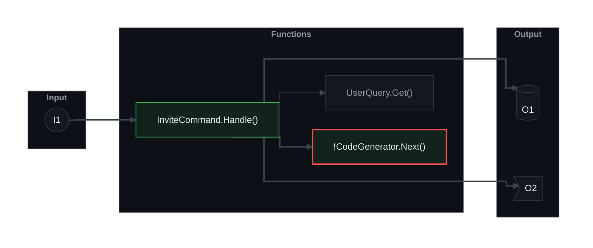

# pr-brief

Pull requests that change many files are hard to read. A reviewer does not know where to start.
pr-brief gives every PR description three things:

1. **Brief**: one conceptual paragraph.
2. **Change map**: Mermaid diagrams that show how the code relates. Each one runs
   **Input → Functions → Output**, one diagram per flow.
3. **Review guide**: what changed, a ranked list of the files that carry logic and risk, and where to start.

The PR title is never changed. Only the description is.

It is a Claude Code plugin with a skill, a gate hook, and a GitHub Action. The tooling is one
Go program with no third-party code. It ships as prebuilt binaries, so you install no runtime.

## Install

```
/plugin marketplace add gagoar/gago-plugins
/plugin install pr-brief@gago-plugins
```

Prose style needs two more skills, depending on the style you pick (see below):

```bash
# ASD-STE100 rewrite (styles: ste, ste+iceberg)
git clone https://github.com/danyuchn/asd-ste100-skill ~/.claude/skills/asd-ste100
# iceberg (styles: iceberg, ste+iceberg)
/plugin install iceberg@gago-plugins
```

## Use

| Command | What it does |
|---|---|
| `/pr-brief` | Write the description for the current branch, and open the PR. |
| `/pr-brief improve <PR# \| URL>` | Rewrite the description of an existing PR. Asks before it writes. |
| `/pr-brief config` | Show or change the three settings. |
| `/pr-brief check <file>` | Run the gate on a description file. |

## What a description looks like

````
<!-- pr-brief:begin v1 style=ste+iceberg theme=github-dark -->
## Brief
Admins can now invite people by email. The service creates a one-time code and sends it to the mailer.

## Change map
### Flow 1: I1 -> invite created

| Ref | What | Detail |
|---|---|---|
| I1 | `POST /invite-code` (new) | The body holds an email and a role. |
| O1 | `invites` table | The service adds one row. |

## Review guide
**What changed**: ...
**Read these first**
| File | Why it is delicate | What to check |
|---|---|---|
| `src/Invite/CodeGenerator.cs` | It makes the secret code. | Check the random source. |

**Review order**: Start at `InviteService.Handle()`.
<!-- pr-brief:end -->
````

Input and Output nodes show only a reference id (`I1`, `O1`). The References table under each
diagram explains them, so the diagram stays small. The diagram text, style included, comes from
`pr-brief diagram`. The gate recomputes it, so a hand-edited colour fails.

## Settings

There are three. Everything else is a fixed convention (see
[`skills/pr-brief/references/convention.md`](skills/pr-brief/references/convention.md)).

```json
{
  "$schema": "https://raw.githubusercontent.com/gagoar/pr-brief/main/schema/pr-brief.schema.json",
  "version": 1,
  "style": "ste+iceberg",
  "improve": { "previous": "drop" },
  "diagram": { "theme": "github-dark" }
}
```

- **`style`**: how the prose is edited.
  `ste+iceberg` (default, for developers) runs the ASD-STE100 rewrite, then iceberg, then the lint.
  `ste` runs the rewrite and the lint. `iceberg` runs iceberg only.
- **`improve.previous`**: what `improve` does with the earlier description.
  `drop` (default) replaces it. `comment` keeps it as a hidden HTML comment at the end.
  The original human text is carried forward unchanged, so blocks never nest.
  A copy is also saved under `~/.local/state/pr-brief/` on every run, whatever you choose.
- **`diagram.theme`**: the look of the diagrams. A built-in name, or a path to a theme file. See Themes.

Files, from highest precedence: `--style` flag, repo `.pr-brief.json`, user
`~/.config/pr-brief/config.json`, default. CI reads only the repo file and the defaults.
An unknown key is an error. `pr-brief config show|get|set|init|validate` reads and writes them.

## Themes

Four are built in. `github-dark` is the default.

| Theme | Where it comes from |
|---|---|
| `github-dark`, `github-light`, `dracula` | [beautiful-mermaid](https://github.com/lukilabs/beautiful-mermaid) (MIT), the library behind [agents.craft.do/mermaid](https://agents.craft.do/mermaid) |
| `alucard` | Dracula's official light theme ([spec](https://draculatheme.com/spec)), mapped the way beautiful-mermaid maps `dracula` |

The style follows beautiful-mermaid's: flat surfaces, thin strokes, sharp corners, orthogonal edges, and
colours derived from the background and the text colour by its own mixing rule. The status colours (added,
modified, removed) are not in beautiful-mermaid. Each theme takes them from its own palette.
See [`internal/theme/UPSTREAM.md`](internal/theme/UPSTREAM.md).

```bash
pr-brief config set diagram.theme dracula                       # your own default
pr-brief config set diagram.theme alucard --scope repo          # the whole team
pr-brief theme list
pr-brief diagram --flow flow.json --theme github-light          # try one without changing the config
```

### Your own theme

A theme is a JSON file in beautiful-mermaid's format: two required colours, five optional ones, and an
optional `status` block.

```json
{
  "$schema": "https://raw.githubusercontent.com/gagoar/pr-brief/main/schema/pr-brief-theme.schema.json",
  "bg": "#10141c",
  "fg": "#e4ecf7",
  "line": "#4a5a78",
  "muted": "#8b9bb4",
  "status": { "added": "#2ecc71", "modified": "#f1c40f", "removed": "#e74c3c" }
}
```

```bash
pr-brief theme validate ./design/theme.json
pr-brief config set diagram.theme ./design/theme.json --scope repo
```

- Colours are hex (`#rgb` or `#rrggbb`), because GitHub accepts nothing else.
- `fg` needs a contrast ratio of 4.5:1 against `bg` and against the node fill, or the file is rejected.
- Missing optional colours are derived from `bg` and `fg`. Missing `status` colours default to green, amber
  and red tuned to the background's lightness.
- `accent` is accepted for compatibility with beautiful-mermaid, where it colours arrowheads. Mermaid
  colours an arrowhead like its edge, so it has no effect here.
- The path is relative to the config file that names it. In a repo config it must stay inside the repo
  (no `..`, no absolute path, no symlink out), so CI reads the same file.
- The begin marker records `theme=custom:<8 hex>`, a hash of the theme. Change the file and old
  diagrams fail the gate until `pr-brief diagram` redraws them.

## The gate

One validator runs in three places.

- **Claude Code hook.** It blocks `gh pr create|edit`, `az repos pr create|update`, and the GitHub and
  Azure DevOps MCP create/update PR tools when the description fails. It reads `--body`,
  `--body-file`, `--description`, a `$(cat <<'EOF' ...)` heredoc and `$(cat file)`. It cannot read a
  shell variable or stdin, so it blocks those and says why. A broken hook payload never blocks a call.
- **GitHub Action.** Add it to a workflow. It reads the PR body from the event payload and needs no
  token beyond the default one:

  ```yaml
  on:
    pull_request:
      types: [opened, edited, synchronize, reopened, ready_for_review]
  permissions:
    contents: read
  jobs:
    description:
      if: github.event.pull_request.draft == false
      runs-on: ubuntu-latest
      steps:
        - uses: actions/checkout@v4   # supplies .pr-brief.json
        - uses: gagoar/pr-brief@v0
  ```
- **`pr-brief gate --file <path>`** from a shell.

To skip one PR, put a visible line in its description: `> pr-brief skipped: <reason>`.

## The CLI

```
pr-brief shape  [--base REF] [--title T] [--working-tree]   diff -> flows (JSON)
pr-brief gate   --hook | --ci | --file F | --stdin [--json]
pr-brief lint   [--file F] [--json]                          ASD-STE100 lint
pr-brief diagram --flow FILE | --report FILE [--flow-number N] [--theme T] [--raw]
pr-brief theme   list | show [NAME|FILE] | validate FILE
pr-brief config show|get|set|init|validate
pr-brief body   improve|past|restore|uncomment
```

`shape` reads the git diff, finds the changed functions (Go, C#, Java, TypeScript/JavaScript,
Python), finds entry points (routes, commands, queue and timer triggers) and outputs (database
writes, published messages, HTTP calls, files, responses), follows the call graph, and builds the
flows. It also maps Terraform, Bicep and GitHub workflow files. A flow that exceeds 9 nodes
collapses to modules, then folds into `+N more`.

## Limits you should know

- The diagram styles are checked on GitHub only (Mermaid 11.17.2, light and dark). **Azure DevOps is not
  verified** for the init line, the invisible `~~~` layout links, or per-edge `linkStyle`. Its Mermaid
  version is unknown.

- `shape` is regex-based, not a compiler. It resolves calls by name, class and folder, and it skips a
  call when two functions could match. The skill starts one reader agent per flow to check and fix the
  draft, but read the diagram before you trust it.
- Function detection covers the languages above. Other code files still count as changed files and get
  ranked, but they give no function nodes.
- The hook adds about 16 ms to each Bash call.
- The Mermaid diagrams use `graph LR` and avoid `click`, links and beta types, so they render on GitHub
  and Azure DevOps. They have not been checked on a self-hosted GitLab or Gitea.
- The ASD-STE100 lint is a Go port of the upstream linter, tested to match its output byte for byte.
  It checks the structural rules, not the full approved dictionary.

## Build

```bash
./build.sh        # needs the Go version in .go-version; writes bin/
go test ./...
```

The binaries in `bin/` are committed so a plugin install needs no build step. CI rebuilds them and
fails if they differ from the committed bytes. `internal/stelint/parity_test.go` compares the lint port
with upstream's Python (`STE_PARITY=1 go test ./internal/stelint -run TestParity`).

## Credits

The diagram themes use the colours, the colour-mixing rule and the style constants of
[beautiful-mermaid](https://github.com/lukilabs/beautiful-mermaid) by Craft Docs (MIT), and the Dracula
colours (MIT). See [`THIRD_PARTY_NOTICES.md`](THIRD_PARTY_NOTICES.md).

The prose lint is a port of [`ste-lint.py`](https://github.com/danyuchn/asd-ste100-skill) by Dustin
Yuchen Teng (MIT). See `internal/stelint/UPSTREAM.md` for the pinned commit and the list of
deviations. ASD-STE100 is a specification owned by ASD; this project does not redistribute it.

## License

MIT
