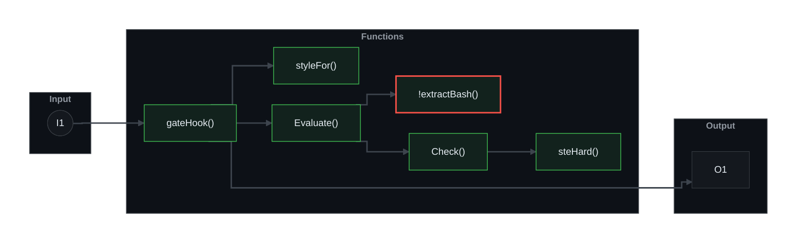
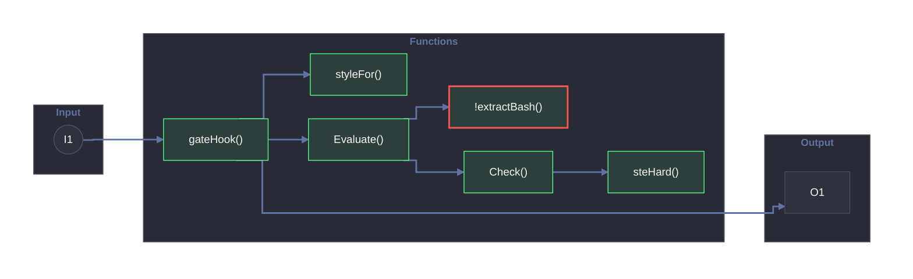
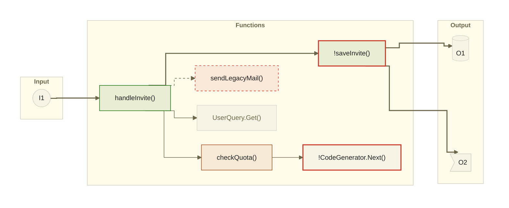
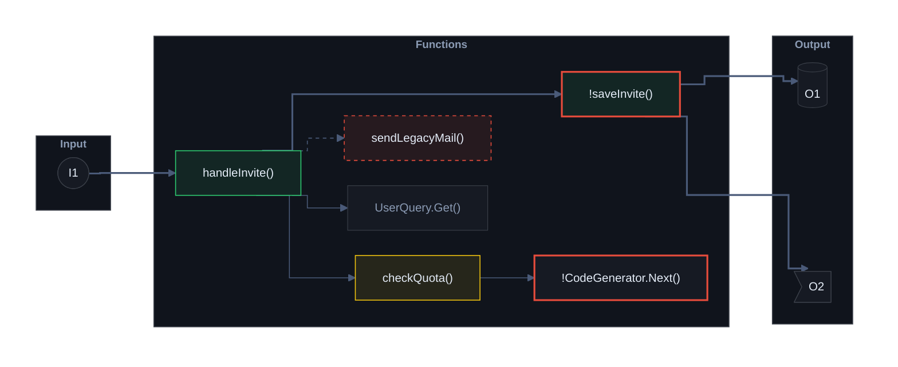
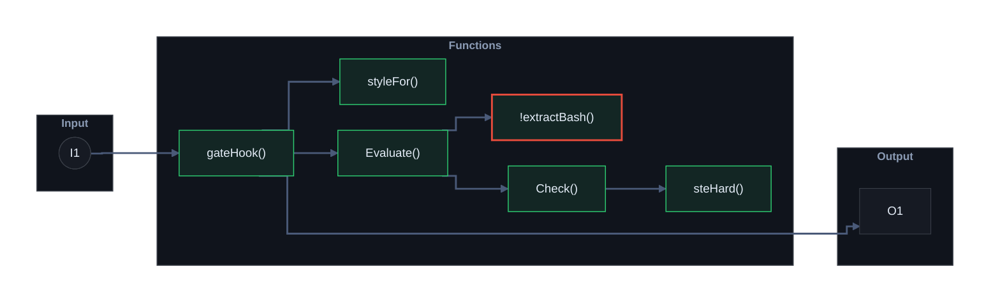

# Sample: the diagram themes, drawn by the tool (do not merge)

Every diagram below is the **unedited output of `pr-brief diagram`** from v0.2.0. Each theme is drawn twice: the **all-states** test flow (every node state and edge kind) and a **realistic** flow (the hook gate from PR #1). Compare them in GitHub's **Light**, **Dark** and **Dark dimmed** appearance (Settings → Appearance).

The fifth theme is a custom file (`examples/theme-custom.json`), to show that your own colours work.

## 1. github-dark

the default.

### All states

### Realistic: the hook-gate flow

- [ ] Light  - [ ] Dark  - [ ] Dark dimmed

## 2. github-light

### All states

### Realistic: the hook-gate flow

- [ ] Light  - [ ] Dark  - [ ] Dark dimmed

## 3. dracula

### All states

### Realistic: the hook-gate flow

- [ ] Light  - [ ] Dark  - [ ] Dark dimmed

## 4. alucard

Dracula's official light theme.

### All states

### Realistic: the hook-gate flow

- [ ] Light  - [ ] Dark  - [ ] Dark dimmed

## 5. custom: examples/theme-custom.json

a custom theme file, in beautiful-mermaid's format.

### All states

### Realistic: the hook-gate flow

- [ ] Light  - [ ] Dark  - [ ] Dark dimmed

---
Throwaway test branch. Theme colours: beautiful-mermaid (MIT, Copyright (c) 2026 Craft Docs) and the Dracula spec (MIT, Copyright (c) 2023 Dracula Theme). See THIRD_PARTY_NOTICES.md.
