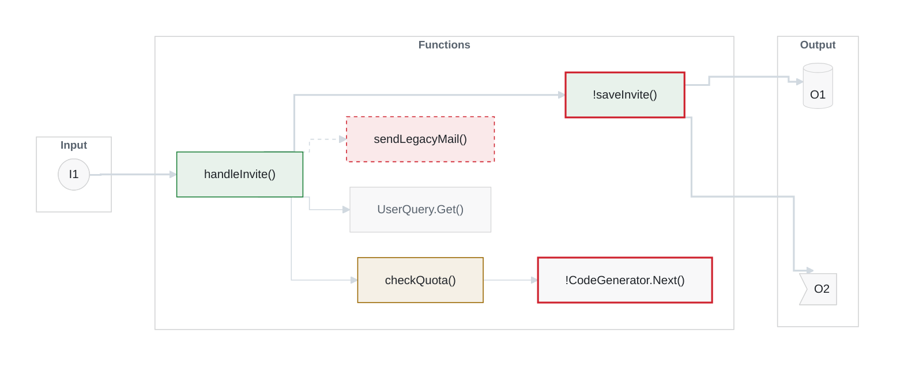
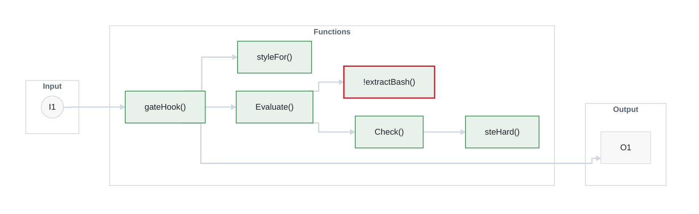
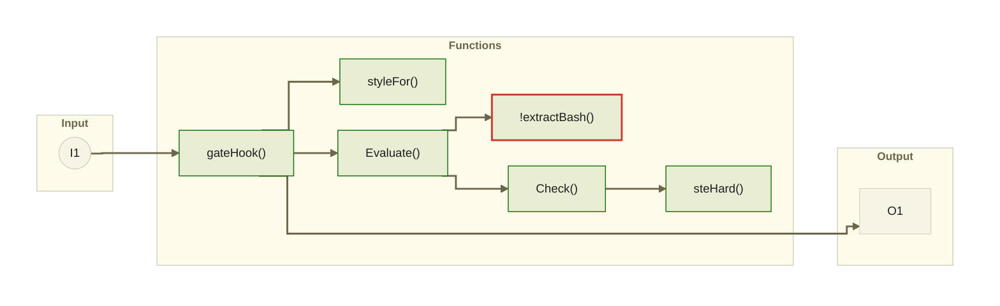

# Sample: pick a diagram look (do not merge)

Four candidates, each drawn twice: the **all-states** test diagram (every node state and edge kind), and a **realistic** one (the hook-gate flow from PR #1). Compare them in GitHub's **Light**, **Dark** and **Dark dimmed** appearance (Settings → Appearance), then tell me which to build in.

| Look | Where it comes from |
|---|---|
| github-light, github-dark | [`lukilabs/beautiful-mermaid`](https://github.com/lukilabs/beautiful-mermaid) `src/theme.ts` (MIT, Copyright (c) 2026 Craft Docs) |
| dracula | the same file |
| alucard | Dracula's official light theme ([spec](https://draculatheme.com/spec), Alucard Classic), mapped the way Craft maps `dracula`: line and muted = Comment, accent = Purple. Not in beautiful-mermaid. |

**How the style is built.** Craft's own mixing rule (node fill 3%, node stroke 20%, line 50%, secondary text 60%, group header 5%) and style constants (sharp corners, 0.75px node strokes, 1px group strokes, 2px thick edges, dotted `4 4`, 13px text at weight 500, 12px group headers at weight 600, orthogonal edges, node spacing 28, layer spacing 48, padding 40). Status colours (added, modified, removed) are not in Craft's themes. They come from each theme's own palette, drawn as a 10% tint with a 1px stroke. Not copyable in Mermaid: accent arrowheads, the group header band, ELK's exact routing.

**Layout fix.** On GitHub's Mermaid 11.17.2, Output drops below Functions unless the deepest function has invisible links to each output (`F5 ~~~ O1`). Edges are styled by index so those links stay invisible.

## 1. github-light

bg `#ffffff` · fg `#1f2328` · line `#d1d9e0` · node fill `#f8f8f9` · node stroke `#d2d3d4` · secondary text `#59636e`

### All states

### Realistic: the hook-gate flow

- [ ] Light  - [ ] Dark  - [ ] Dark dimmed

## 2. github-dark

bg `#0d1117` · fg `#e6edf3` · line `#3d444d` · node fill `#14181e` · node stroke `#383d43` · secondary text `#9198a1`

### All states

### Realistic: the hook-gate flow

- [ ] Light  - [ ] Dark  - [ ] Dark dimmed

## 3. dracula

bg `#282a36` · fg `#f8f8f2` · line `#6272a4` · node fill `#2e303c` · node stroke `#52535c` · secondary text `#6272a4`

### All states

### Realistic: the hook-gate flow

- [ ] Light  - [ ] Dark  - [ ] Dark dimmed

## 4. alucard

bg `#FFFBEB` · fg `#1F1F1F` · line `#6C664B` · node fill `#f8f4e5` · node stroke `#d2cfc2` · secondary text `#6C664B`

### All states

### Realistic: the hook-gate flow

- [ ] Light  - [ ] Dark  - [ ] Dark dimmed

---
Throwaway test branch. Theme values: MIT License, Copyright (c) 2026 Craft Docs, https://github.com/lukilabs/beautiful-mermaid/blob/main/LICENSE
