# Sample: Craft / beautiful-mermaid themes (do not merge)

The styles here are taken from [`lukilabs/beautiful-mermaid`](https://github.com/lukilabs/beautiful-mermaid) (MIT, Copyright (c) 2026 Craft Docs), the library behind [agents.craft.do/mermaid](https://agents.craft.do/mermaid). Each look uses that project's **own theme colours** (`src/theme.ts`), its **own mixing rule** (node fill 3%, node stroke 20%, line 50%, secondary text 60%, group header 5%), and its **own style constants** (`src/styles.ts`, `src/renderer.ts`):

| Craft constant | Value | Mermaid setting used here |
|---|---|---|
| Corners | sharp (`rx=0`) | Mermaid's default rectangle |
| Node stroke | 0.75px | `classDef … stroke-width:0.75px` |
| Group box stroke | 1px, fill = background | `classDef zone`, `clusterBkg`, `clusterBorder` |
| Edge stroke | 1px, thick 2px, dotted `4 4` | `linkStyle` by edge index |
| Node text | 13px, weight 500 | `fontSize`, `font-weight:500` |
| Group header text | 12px, weight 600, secondary colour | `classDef zone … font-size:12px,font-weight:600` |
| Font | Inter | `fontFamily: Inter, Helvetica, Arial` (no hyphens: GitHub blanks a theme value that has one; the viewer needs Inter installed because GitHub blocks web fonts) |
| Arrowheads | accent colour (or fg 85%) | **not possible**: Mermaid colours arrowheads like the edge, so they use the line colour |
| Shadows | none | `dropShadow: none` |
| Edge routing | orthogonal | `curve: step` |
| Spacing | node 28, layer 48, padding 40 | `nodeSpacing`, `rankSpacing`, `diagramPadding` |

**What is not from Craft.** Their themes have no "added / modified / removed" colours, so those come from each theme's own editor palette (Tokyo Night, Catppuccin, Nord, and so on), drawn in Craft's style: a 10% tint fill (their `keyBadge` mix) with a 1px coloured stroke. **What Mermaid cannot copy:** the accent-coloured arrowheads, the header band on each group, and ELK's exact edge routing (`curve: step` is the closest).

Every look draws the **same** diagram, so only the style changes. Compare in GitHub's Light, Dark and Dark dimmed appearance (Settings → Appearance). Dark themes paint their own group boxes, but the page behind the diagram is GitHub's.

**Layout fix (found by testing on GitHub's own Mermaid 11.17.2).** Without help, GitHub drops the Output box *below* the Functions box and routes an edge behind an unrelated node. Two invisible links (`F5 ~~~ O1`, `F5 ~~~ O2`, from the deepest function to each output) keep Output to the right. Edges are styled by index, because `linkStyle default` would also paint the invisible links. The baseline (0) is left as it is today, to show the problem.

**Alucard** (look 16) is Dracula's official light theme. It is *not* in beautiful-mermaid. Its colours come from the [Dracula spec](https://draculatheme.com/spec) (Alucard Classic), mapped the way Craft maps `dracula`: line and muted = Comment, accent = Purple.

## 0. Today (baseline)

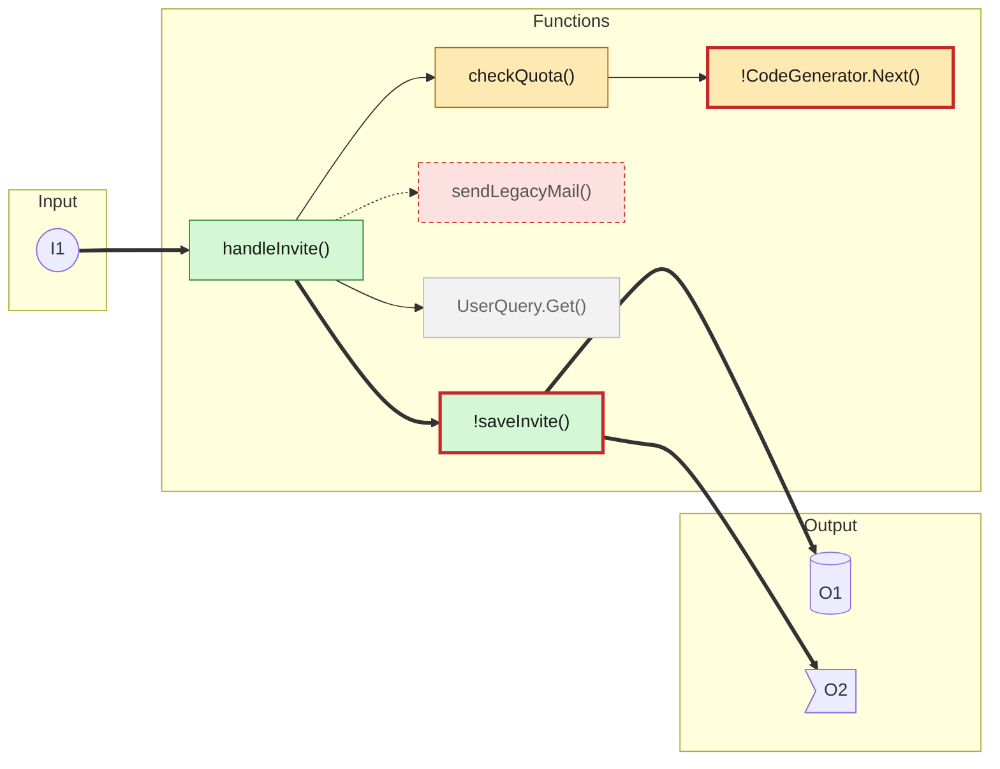

## 1. zinc-light

bg `#FFFFFF` · fg `#27272A` · line `#939394` · node fill `#f9f9f9` · node stroke `#d4d4d4` · secondary text `#7d7d7f`

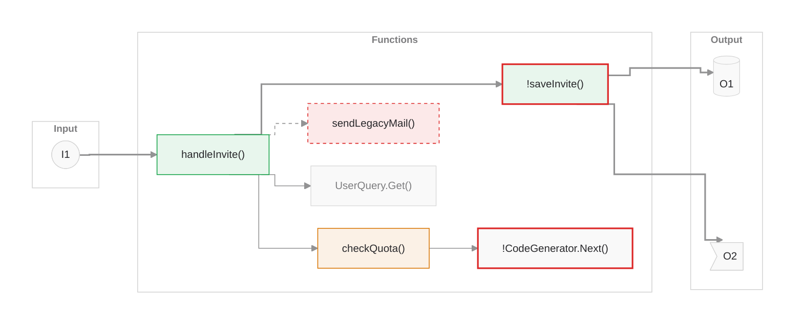

- [ ] Light  - [ ] Dark  - [ ] Dark dimmed

## 2. zinc-dark

bg `#18181B` · fg `#FAFAFA` · line `#89898a` · node fill `#1f1f22` · node stroke `#454548` · secondary text `#a0a0a1`

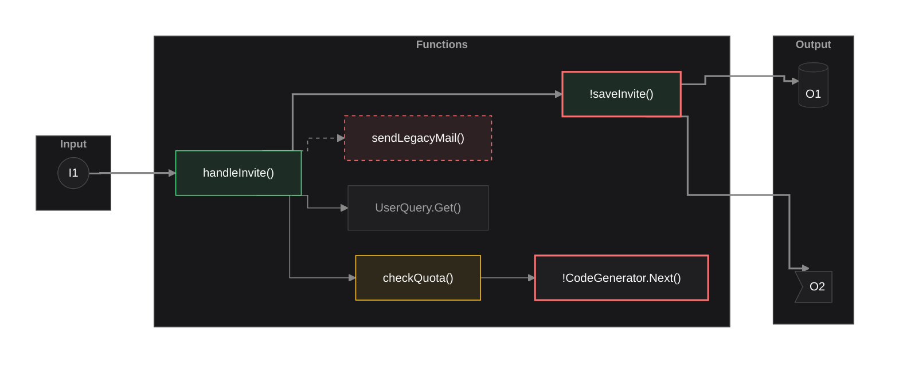

- [ ] Light  - [ ] Dark  - [ ] Dark dimmed

## 3. tokyo-night

bg `#1a1b26` · fg `#a9b1d6` · line `#3d59a1` · node fill `#1e202b` · node stroke `#373949` · secondary text `#565f89`

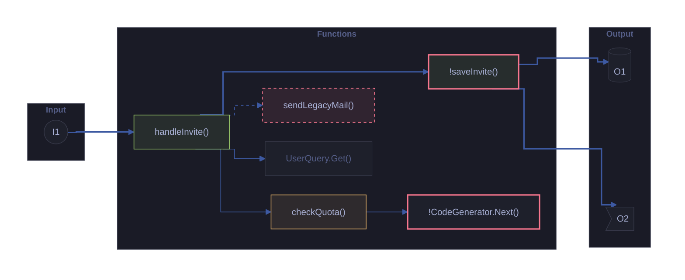

- [ ] Light  - [ ] Dark  - [ ] Dark dimmed

## 4. tokyo-night-storm

bg `#24283b` · fg `#a9b1d6` · line `#3d59a1` · node fill `#282c40` · node stroke `#3f435a` · secondary text `#565f89`

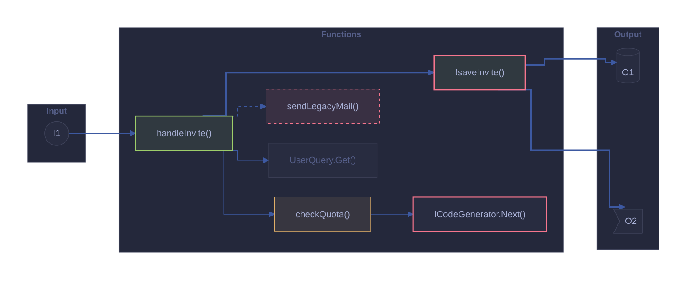

- [ ] Light  - [ ] Dark  - [ ] Dark dimmed

## 5. tokyo-night-light

bg `#d5d6db` · fg `#343b58` · line `#34548a` · node fill `#d0d1d7` · node stroke `#b5b7c1` · secondary text `#9699a3`

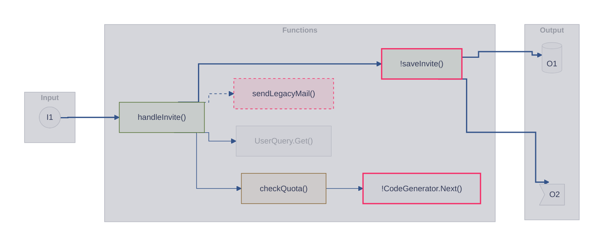

- [ ] Light  - [ ] Dark  - [ ] Dark dimmed

## 6. catppuccin-mocha

bg `#1e1e2e` · fg `#cdd6f4` · line `#585b70` · node fill `#232434` · node stroke `#414356` · secondary text `#6c7086`

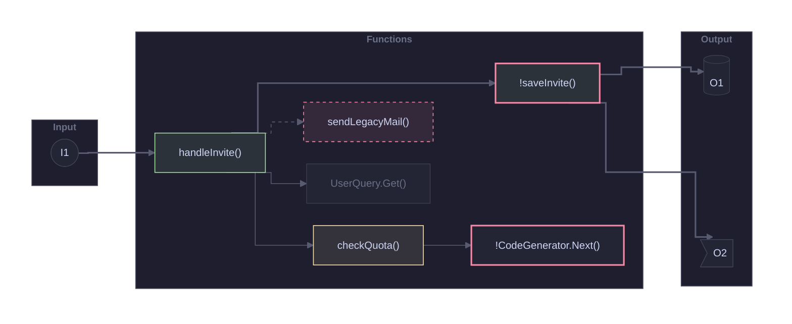

- [ ] Light  - [ ] Dark  - [ ] Dark dimmed

## 7. catppuccin-latte

bg `#eff1f5` · fg `#4c4f69` · line `#9ca0b0` · node fill `#eaecf1` · node stroke `#ced1d9` · secondary text `#9ca0b0`

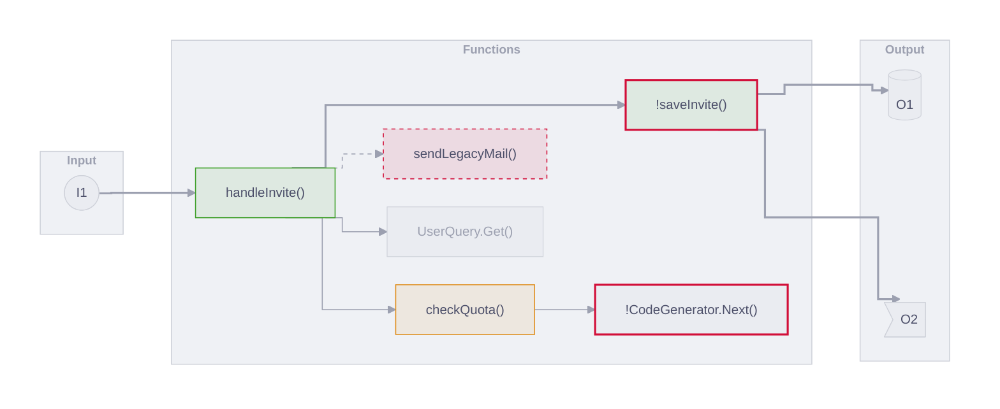

- [ ] Light  - [ ] Dark  - [ ] Dark dimmed

## 8. nord

bg `#2e3440` · fg `#d8dee9` · line `#4c566a` · node fill `#333945` · node stroke `#505662` · secondary text `#616e88`

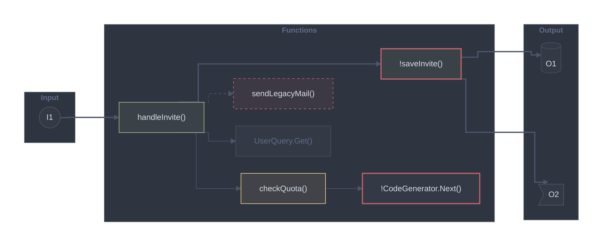

- [ ] Light  - [ ] Dark  - [ ] Dark dimmed

## 9. nord-light

bg `#eceff4` · fg `#2e3440` · line `#aab1c0` · node fill `#e6e9ef` · node stroke `#c6cad0` · secondary text `#7b88a1`

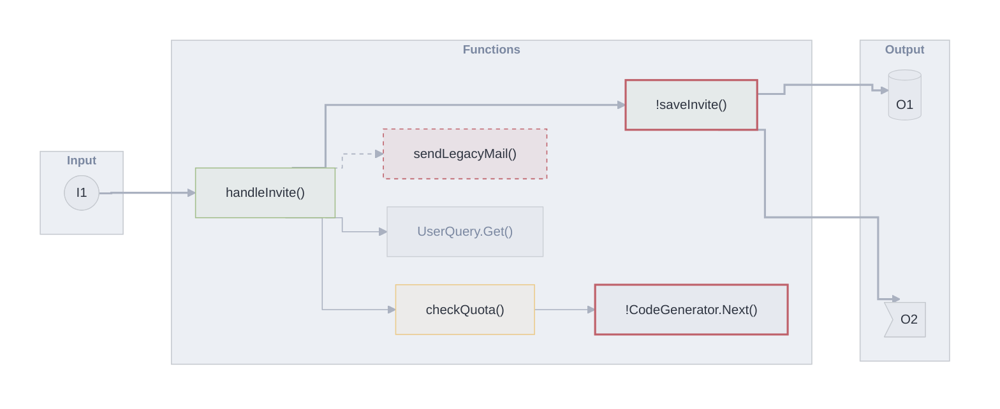

- [ ] Light  - [ ] Dark  - [ ] Dark dimmed

## 10. dracula

bg `#282a36` · fg `#f8f8f2` · line `#6272a4` · node fill `#2e303c` · node stroke `#52535c` · secondary text `#6272a4`

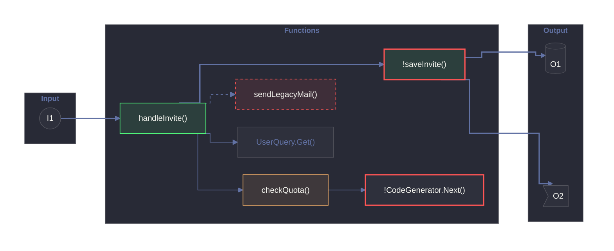

- [ ] Light  - [ ] Dark  - [ ] Dark dimmed

## 11. github-light

bg `#ffffff` · fg `#1f2328` · line `#d1d9e0` · node fill `#f8f8f9` · node stroke `#d2d3d4` · secondary text `#59636e`

- [ ] Light  - [ ] Dark  - [ ] Dark dimmed

## 12. github-dark

bg `#0d1117` · fg `#e6edf3` · line `#3d444d` · node fill `#14181e` · node stroke `#383d43` · secondary text `#9198a1`

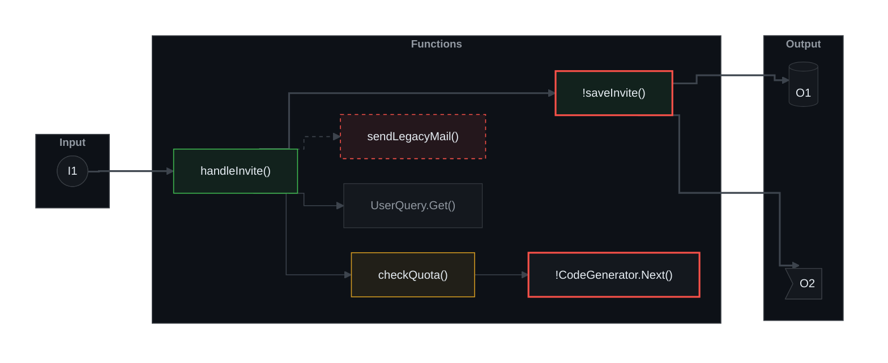

- [ ] Light  - [ ] Dark  - [ ] Dark dimmed

## 13. solarized-light

bg `#fdf6e3` · fg `#657b83` · line `#93a1a1` · node fill `#f8f2e0` · node stroke `#dfddd0` · secondary text `#93a1a1`

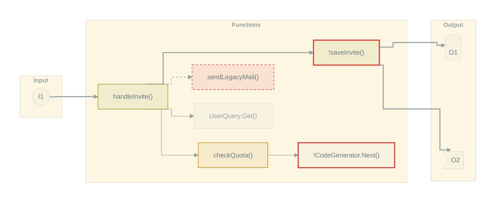

- [ ] Light  - [ ] Dark  - [ ] Dark dimmed

## 14. solarized-dark

bg `#002b36` · fg `#839496` · line `#586e75` · node fill `#042e39` · node stroke `#1a4049` · secondary text `#586e75`

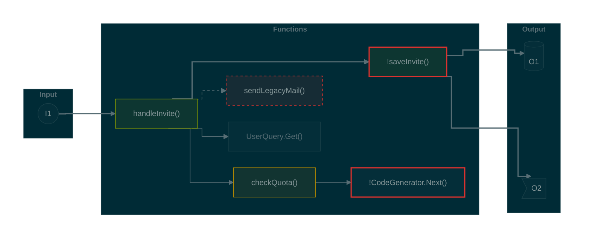

- [ ] Light  - [ ] Dark  - [ ] Dark dimmed

## 15. one-dark

bg `#282c34` · fg `#abb2bf` · line `#4b5263` · node fill `#2c3038` · node stroke `#424750` · secondary text `#5c6370`

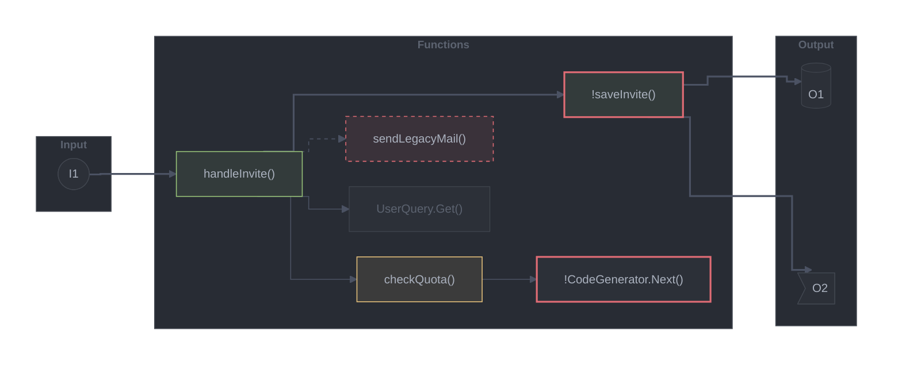

- [ ] Light  - [ ] Dark  - [ ] Dark dimmed

## 16. alucard

bg `#FFFBEB` · fg `#1F1F1F` · line `#6C664B` · node fill `#f8f4e5` · node stroke `#d2cfc2` · secondary text `#6C664B`

- [ ] Light  - [ ] Dark  - [ ] Dark dimmed

---
Throwaway test branch. Theme values: MIT License, Copyright (c) 2026 Craft Docs, https://github.com/lukilabs/beautiful-mermaid/blob/main/LICENSE
