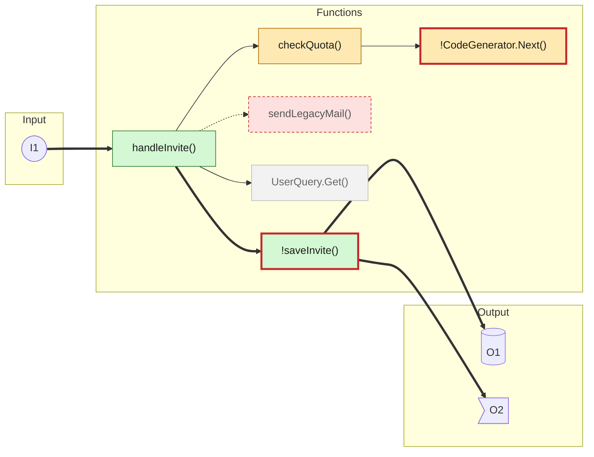
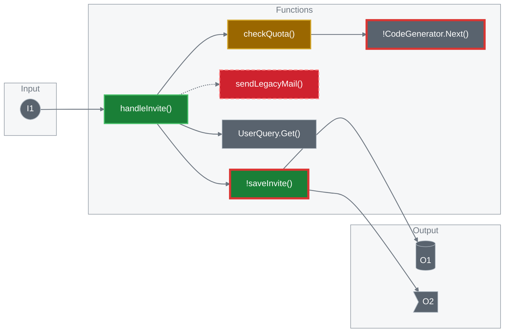
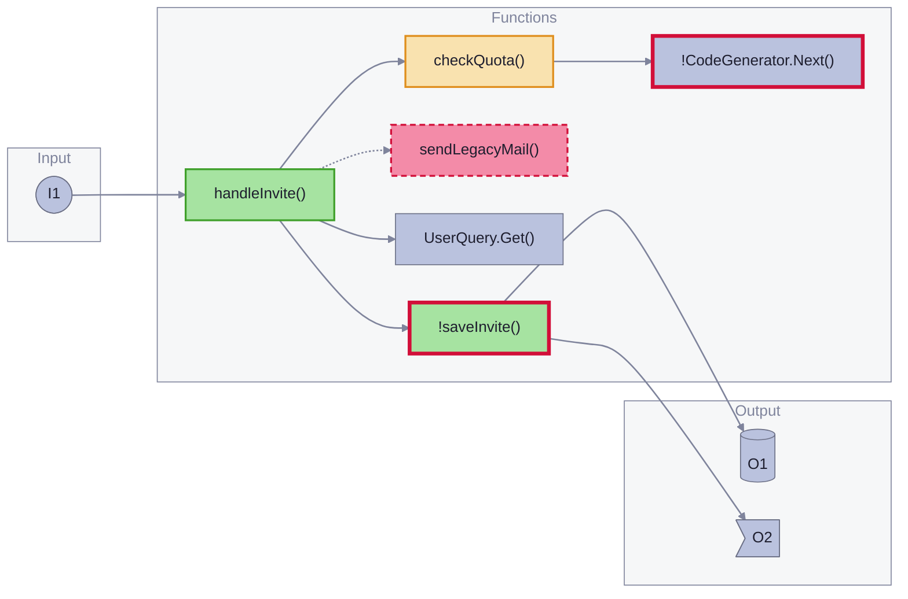
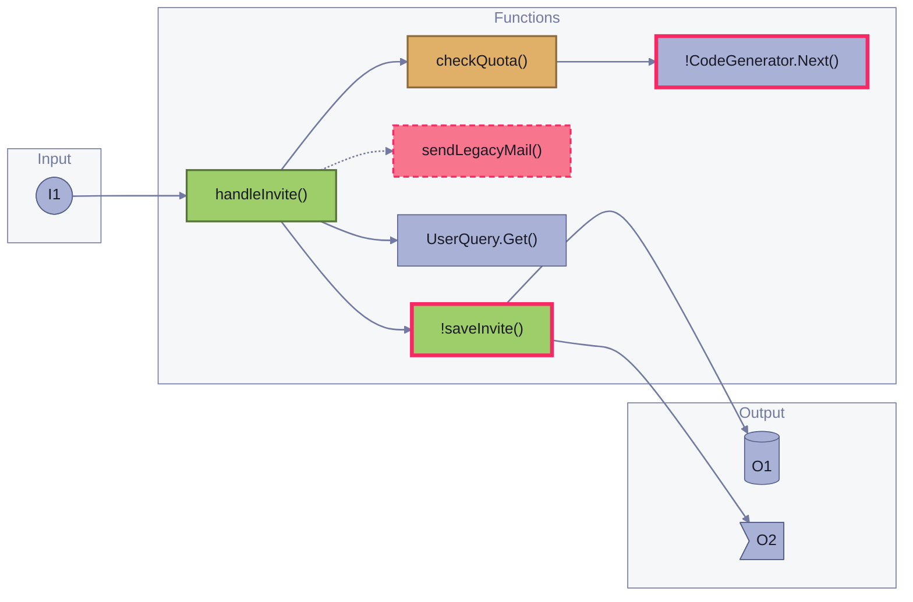
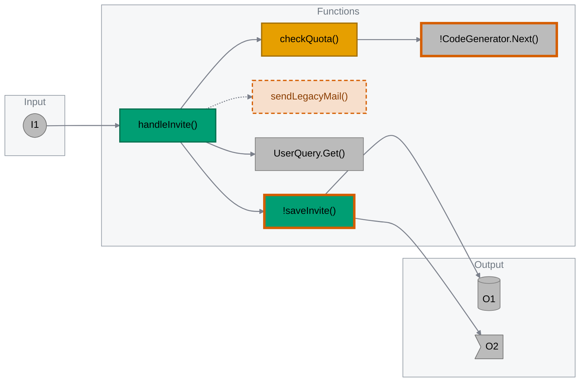
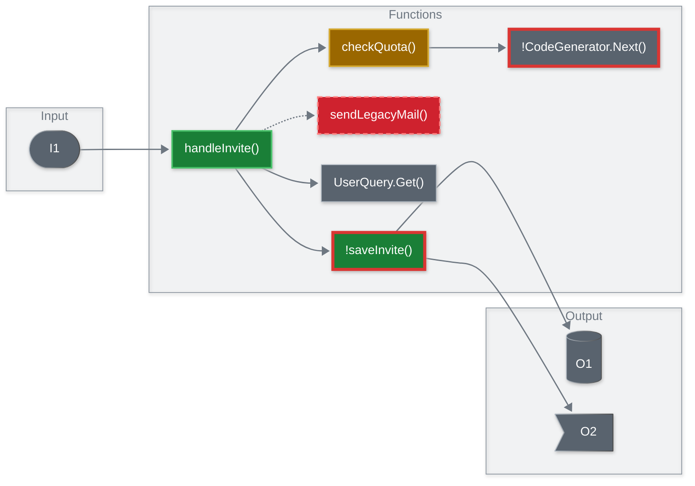
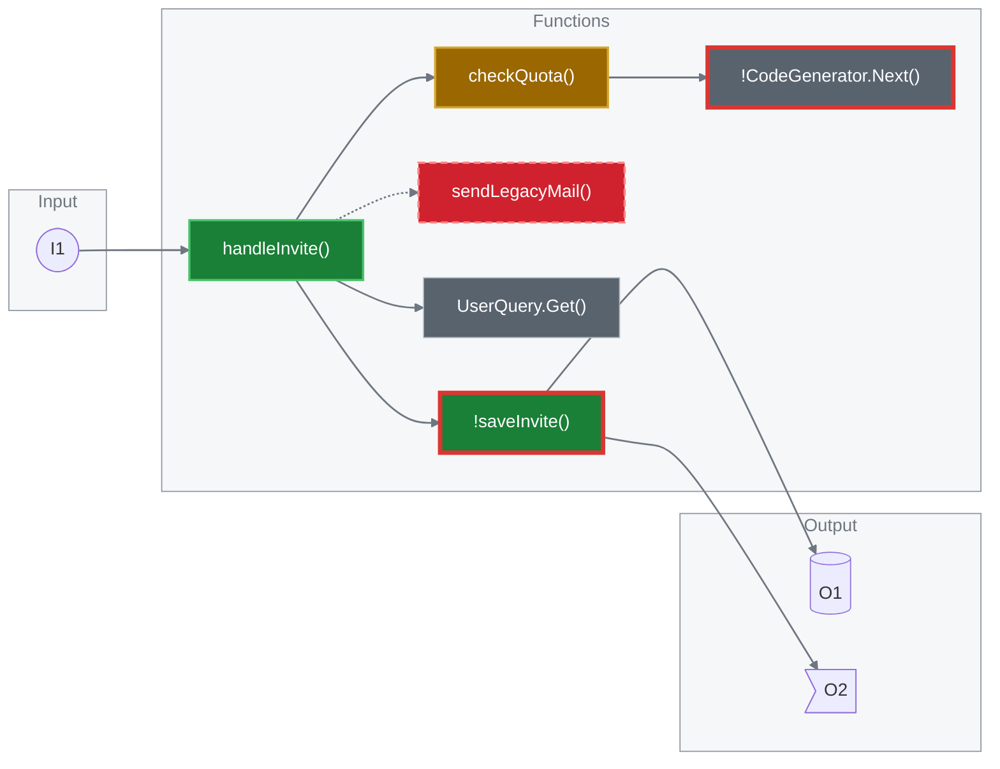

# Sample: diagram looks (do not merge)

Eight looks for the pr-brief Change map, drawn from the **same** diagram. It has all six node states (added, modified, removed, context, risk, risk + added), all three edge kinds (new `==>`, existing `-->`, removed `-.->`), and the three Input / Functions / Output boxes.

**How to compare.** Open this page in GitHub's **Light**, **Dark** and **Dark dimmed** appearance (Settings → Appearance). For each look, check:

- Can you read every label?
- Can you see the thick red border on the two risk nodes, and the dashed border on the removed node?
- Do the three boxes and the edges look calm, not noisy?
- Is the look the same in the other modes?

The block below prints the Mermaid version GitHub is running:

```mermaid
info
```

## A. Today (baseline)

The current look: Mermaid's default theme, the six hand-written `classDef` lines, and Mermaid's default pastel colours on the three subgraph boxes. No init line.



- [ ] Light  - [ ] Dark  - [ ] Dark dimmed

## B. Primer Solid, init + classDef

GitHub-native saturated fills with white text. One `%%{init}%%` line (base theme, grey edges, spacing) plus `classDef`, neutral subgraph boxes and grey edges.



- [ ] Light  - [ ] Dark  - [ ] Dark dimmed

## C. Primer Solid, classDef only

The same node colours with no init line. Only `classDef`, a neutral `zone` class for the three boxes, and `linkStyle default` for edges. The most portable version.


- [ ] Light  - [ ] Dark  - [ ] Dark dimmed

## D. Catppuccin pastel, init + classDef

Soft pastels with dark labels. The closest to the Craft / Beautiful Mermaid feel.



- [ ] Light  - [ ] Dark  - [ ] Dark dimmed

## E. Tokyo Night, init + classDef

Neon pastels with deep-ink labels.



- [ ] Light  - [ ] Dark  - [ ] Dark dimmed

## F. Okabe-Ito, init + classDef

Colour-blind-safe colours with black text. Removed nodes are pale dashed ghosts.



- [ ] Light  - [ ] Dark  - [ ] Dark dimmed

## G. Primer Solid, YAML frontmatter + neo look

A `---` config block with `look: neo`, curve and spacing instead of an init line. Tests what GitHub accepts. Likely to fail on Azure DevOps.



- [ ] Light  - [ ] Dark  - [ ] Dark dimmed

## H. Primer Solid, init + fonts

Look B plus `fontFamily` and `fontSize` in the init line. Tests whether GitHub honours fonts, and whether the font setting breaks the rest of the init line.



- [ ] Light  - [ ] Dark  - [ ] Dark dimmed

---
This page is a throwaway test branch. It is not part of the plugin.
