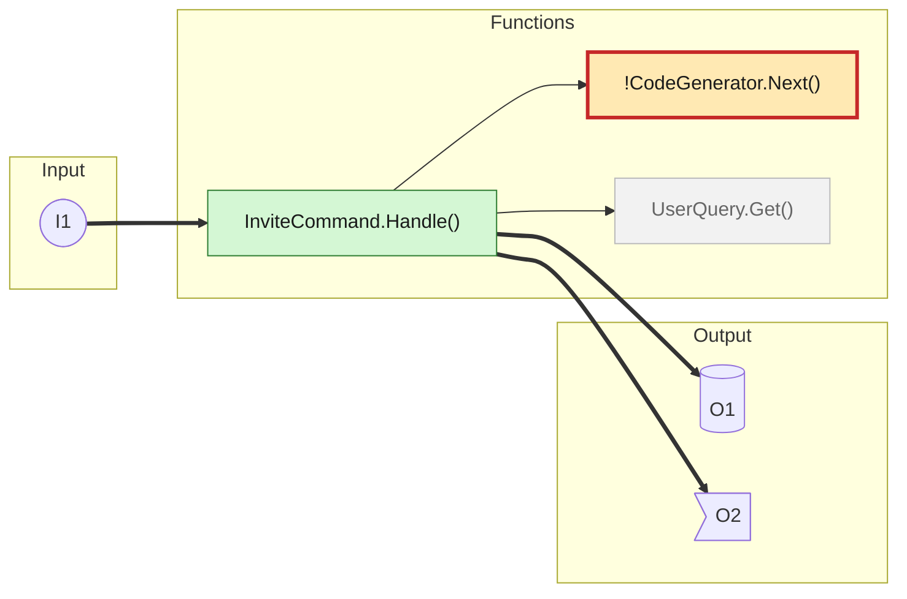

# Diagram convention: Input -> Functions -> Output

A diagram shows how code relates. Data enters on the left, passes through the changed code in the
middle, and leaves on the right. Draw one diagram per flow. A flow is one Input and everything it
reaches. `pr-brief shape` finds the flows; you draw them.

## Turning `pr-brief shape` JSON into a diagram

For each entry in `flows` (the tool already keeps the top 3 and numbers the references):

1. Write the heading `### Flow N: I1 -> <short title>`. The title says what the flow does.
2. Write the diagram. Use the skeleton below.
3. Write the References table directly under it.

### Skeleton

````

````

Copy the six `classDef` lines exactly. Every one sets a fill and a text colour, so the diagram stays
readable in dark mode.

### Mapping

| JSON | Mermaid |
|---|---|
| `inputs[]` | `I1(["I1"])` in the `Input` subgraph. Always a stadium. |
| `functions[].node` and `label` | `F1["<label>"]` in the `Functions` subgraph |
| `functions[].status` | `added` -> `:::added`, `modified` -> `:::modified`, `removed` -> `:::removed`, `context` -> `:::context` |
| a function with `riskScore >= 2` | prefix the label with `!`. Use `:::risk` (or `:::riskadded` if added). |
| `outputs[]`, kind `db` | cylinder: `O1[("O1")]` |
| `outputs[]`, kind `event` | flag: `O2>"O2"]` |
| `outputs[]`, other kinds | box: `O3["O3"]` |
| `edges[].status` `new` | `==>` |
| `edges[].status` `existing` | `-->` |
| `edges[].status` `removed` | `-.->` |

Rules the gate enforces:

- `graph LR`, three subgraphs, in the order Input, Functions, Output. Every node sits inside one.
- Input labels match `I<n>`. Output labels match `O<n>`. No descriptions in the diagram.
- Edges run left to right only. Nothing leaves an Output. Nothing enters an Input.
- Quote every label. One declaration, or one edge chain, per line.
- Limits: 9 nodes, 14 edges, 28 characters per label, 2 context nodes.
- No `flowchart`, no `click`, no links.

If a label has a double quote, change it to a single quote. Use `<br>` for a line break.

## References table

Directly under each diagram:

```
| Ref | What | Detail |
|---|---|---|
| I1 | `POST /invite-code` (new) | The body holds an email and a role. Admins only. |
| O1 | `invites` table | The service adds one row: code, email, expiry. |
| O2 | `InviteCreated` event | The mailer reads it from the `notifications` topic. |
```

- Write a row for every `I<n>` and `O<n>` in the diagram. Write no row for an id the diagram lacks.
- An id means one thing in the whole description. When a later flow uses `I1` again, write
  `| I1 | see Flow 1 | |`. Never redefine it.
- What: the route, command, table, topic, file or resource. Add `(new)` or `(removed)` when it is new
  or removed. Start from `refs[id].what` in the JSON and fix it from the code.
- Detail: one or two short sentences with what would crowd the diagram: the payload or columns, auth,
  the consumer, side effects. This is prose, so the style pipeline and the lint apply to it.
- A `multiple` output (`"3 more outputs: a; b; c"`) gets one row that lists its parts.

## When the flow is too big

`pr-brief shape` already collapses a flow that exceeds 9 nodes:

1. `collapsedLevel: "module"`: functions of one class are one node, labelled `Class (3 fns)`.
2. `collapsedLevel: "more"`: the least important nodes fold into one `+N more` node.

Keep the collapse. List the folded functions in the Review guide under **What changed**
(`functions[].members` has them). If `droppedFlows` is not empty, name those flows in the Review
guide and say that the PR is large enough to consider splitting.

## Extra diagrams

`extras[]` lists diagram types to add. Each counts toward the cap of 3, so drop the weakest flow
first if you hit it.

| `type` | Draw |
|---|---|
| `stateDiagram-v2` | The states and transitions after the change. Use `note` for removed transitions. |
| `erDiagram` | Only the changed tables, with changed columns marked `+col` or `-col`. No `:::class` (it needs Mermaid 11). |
| `sequenceDiagram` | The call order of the fixed path. Wrap the fix in `rect rgb(255,233,179)` and show `alt before / after`. At most 6 participants. |

Extras need no References table. Give each a `### Extra: <what>` heading.

## Infrastructure and pipelines

Infrastructure follows the same shape. The tool already maps it:

- Input: parameters, variables, workflow triggers.
- Functions: the changed resources, modules and jobs.
- Output: outputs, deploy steps, or a summary of what gets deployed.

## Portability (GitHub and Azure DevOps)

- Write `graph LR`. Azure DevOps rejects the `flowchart` keyword.
- Use the ```` ```mermaid ```` fence. Both platforms accept it.
- Leave out `click`, links, HTML other than `<br>`, and beta diagram types.
- Keep the `classDef` colours. They are tested in light and dark mode.
- If `npx` exists, parse-check each diagram:
  `npx -y @mermaid-js/mermaid-cli -i diagram.mmd -o /tmp/out.svg`. Skip the check when `npx` is missing.
