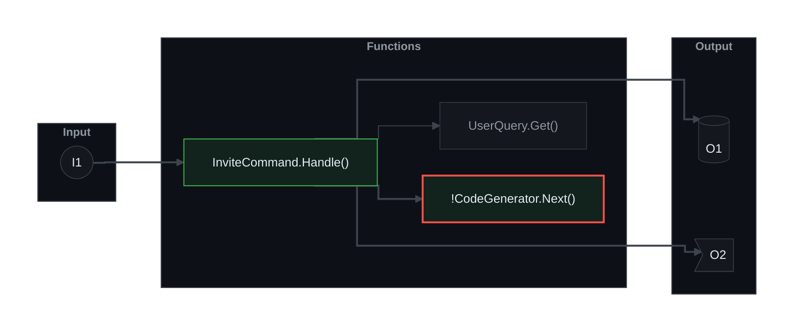

# Diagram convention: Input -> Functions -> Output

A diagram shows how code relates. Data enters on the left, passes through the changed code in the
middle, and leaves on the right. Draw one diagram per flow. A flow is one Input and everything it
reaches. `pr-brief shape` finds the flows. **`pr-brief diagram` draws them.** You never write the
style by hand: the init line, the colours, the edge numbers and the layout links are all produced from
the theme, and the gate recomputes them. Text that did not come from the tool fails the gate.

## How to draw a flow

1. Take a flow from `pr-brief shape`, with the corrections the reader agent made.
2. Save it as a flow JSON file (shape below). `shape` output already has this shape.
3. Run `"$PRB" diagram --flow flow.json`. Or, straight from the report: `"$PRB" diagram --report shape.json --flow-number 1`.
4. Paste the output, fence included, under a `### Flow N: I1 -> <what the flow does>` heading.
5. Write the References table directly under it (below).

The tool picks the theme from the config (`diagram.theme`). To try another one, add
`--theme dracula` or `--theme ./my-theme.json`. The description's begin marker must name the theme the
diagram uses: `<!-- pr-brief:begin v1 style=ste+iceberg theme=github-dark -->`. Get the id from
`"$PRB" theme show --json` (`id`), which is a built-in name or `custom:<8 hex>`.

### The flow JSON

Node-link shaped. Schema: `schema/pr-brief-flow.schema.json`.

```json
{
  "version": 1,
  "inputs": [{ "id": "I1" }],
  "nodes": [
    { "id": "F1", "label": "InviteCommand.Handle()", "status": "added" },
    { "id": "F2", "label": "CodeGenerator.Next()", "status": "added", "riskScore": 3 },
    { "id": "F3", "label": "UserQuery.Get()", "status": "context" }
  ],
  "outputs": [{ "id": "O1", "kind": "db" }, { "id": "O2", "kind": "event" }],
  "edges": [
    { "from": "I1", "to": "F1", "status": "new" },
    { "from": "F1", "to": "F2", "status": "new" },
    { "from": "F1", "to": "F3", "status": "existing" },
    { "from": "F1", "to": "O1", "status": "new" },
    { "from": "F1", "to": "O2", "status": "new" }
  ]
}
```

| Field | Meaning |
|---|---|
| `inputs[].id` | `I1`, `I2`, ... The diagram shows only the id. |
| `nodes[].id`, `label`, `status` | `F1`, ...; the function or module name (28 characters at most); `added`, `modified`, `removed` or `context` |
| `nodes[].riskScore` | 2 or more adds the `!` prefix and a red border |
| `outputs[].id`, `kind` | `O1`, ...; `db` draws a cylinder, `event` a flag, anything else a box |
| `edges[]` | `new` is `==>`, `existing` is `-->`, `removed` is `-.->` |

The tool rejects a flow that breaks the limits (9 nodes, 14 edges, 28-character labels, 2 context
nodes) and tells you which one. Collapse the flow first (see "When the flow is too big").

### What the tool prints for that flow

The `github-dark` theme:



What the tool does, so you can check its output:

| Input | Output |
|---|---|
| Input node | stadium `([...])`, labelled only `I<n>` |
| `status` | `:::added`, `:::modified`, `:::removed`, `:::context` |
| risk | `!` prefix on the label; `:::risk` (or `:::riskadded` if added); not on a removed node |
| Output node | labelled only `O<n>`; shape by `kind` |
| edge `status` | arrow `==>`, `-->`, `-.->`; one `linkStyle` line per kind, by edge number |
| layout | `F? ~~~ O?` from the deepest function to each output (see below) |

### Why the invisible links

On GitHub's Mermaid (11.17.2) the Output box drops **below** the Functions box, and an edge runs behind an
unrelated node, unless the deepest function links to every output. A `~~~` link draws nothing but ranks
each output after the whole Functions box. The tool adds them. Do not remove them, and do not add a
`linkStyle default` line: it would paint the invisible links.

## Rules the gate enforces

- `graph LR`, three subgraphs in the order Input, Functions, Output. Every node sits inside one.
- Input labels match `I<n>`. Output labels match `O<n>`. No descriptions in the diagram.
- Edges run left to right only. Nothing leaves an Output. Nothing enters an Input.
- Limits: 9 nodes, 14 edges (the invisible links do not count), 28 characters per label, 2 context nodes.
- No `flowchart`, no `click`, no links.
- The init line, every `classDef`, the `class` line and every `linkStyle` line equal what the theme requires.
- The invisible links are exactly the ones the tool adds.

## References table

Directly under each diagram:

```
| Ref | What | Detail |
|---|---|---|
| I1 | `POST /invite-code` (new) | The body holds an email and a role. Admins only. |
| O1 | `invites` table | The service adds one row: code, email, expiry. |
| O2 | `InviteCreated` event | The mailer reads it from the `notifications` topic. |
```

- Write a row for every `I<n>` and `O<n>` in the diagram. Write no row for an id the diagram lacks.
- An id means one thing in the whole description. When a later flow uses `I1` again, write
  `| I1 | see Flow 1 | |`. Never redefine it.
- What: the route, command, table, topic, file or resource. Add `(new)` or `(removed)` when it is new
  or removed. Start from `refs[id].what` in the shape report and fix it from the code.
- Detail: one or two short sentences with what would crowd the diagram: the payload or columns, auth,
  the consumer, side effects. This is prose, so the style pipeline and the lint apply to it.
- A `multiple` output (`"3 more outputs: a; b; c"`) gets one row that lists its parts.

## When the flow is too big

`pr-brief shape` already collapses a flow that exceeds 9 nodes:

1. `collapsedLevel: "module"`: functions of one class are one node, labelled `Class (3 fns)`.
2. `collapsedLevel: "more"`: the least important nodes fold into one `+N more` node.

Keep the collapse. List the folded functions in the Review guide under **What changed**
(`functions[].members` has them). If `droppedFlows` is not empty, name those flows in the Review
guide and say that the PR is large enough to consider splitting.

## Themes

Four are built in: `github-dark` (the default), `github-light`, `dracula` and `alucard` (Dracula's
light theme). Change it with `/pr-brief config` or `pr-brief config set diagram.theme dracula`.

A custom theme is a JSON file in beautiful-mermaid's format, with an optional `status` block. See
`examples/theme-custom.json` and `schema/pr-brief-theme.schema.json`. Point the config at it with
`pr-brief config set diagram.theme ./design/theme.json --scope repo`. In a repo config the path must stay
inside the repo, so CI can read the same file. `pr-brief theme validate FILE` checks it. Text must keep a
contrast ratio of 4.5:1 against the background and the node fill, or the file is rejected.

`accent` is accepted for beautiful-mermaid compatibility and has no effect: Mermaid colours an
arrowhead like its edge.

## Extra diagrams

`extras[]` lists diagram types to add. Each counts toward the cap of 3, so drop the weakest flow
first if you hit it. They are not themed and the gate does not check their style.

| `type` | Draw |
|---|---|
| `stateDiagram-v2` | The states and transitions after the change. Use `note` for removed transitions. |
| `erDiagram` | Only the changed tables, with changed columns marked `+col` or `-col`. No `:::class` (it needs Mermaid 11). |
| `sequenceDiagram` | The call order of the fixed path. Wrap the fix in `rect rgb(255,233,179)` and show `alt before / after`. At most 6 participants. |

Extras need no References table. Give each a `### Extra: <what>` heading.

## Infrastructure and pipelines

Infrastructure follows the same shape. The tool already maps it:

- Input: parameters, variables, workflow triggers.
- Functions: the changed resources, modules and jobs.
- Output: outputs, deploy steps, or a summary of what gets deployed.

## Portability (GitHub and Azure DevOps)

- Checked on GitHub (Mermaid 11.17.2, light and dark). Azure DevOps is **not** verified for the init
  line, `~~~` links or per-edge `linkStyle`; its Mermaid version is unknown.
- Write `graph LR`. Azure DevOps rejects the `flowchart` keyword.
- Use the ```` ```mermaid ```` fence. Both platforms accept it.
- Leave out `click`, links, HTML other than `<br>`, and beta diagram types.
- GitHub blanks a theme value that contains a hyphen. That is why the font is `Inter, Helvetica, Arial`.
- If `npx` exists, parse-check each diagram:
  `npx -y @mermaid-js/mermaid-cli -i diagram.mmd -o /tmp/out.svg`. Skip the check when `npx` is missing.
